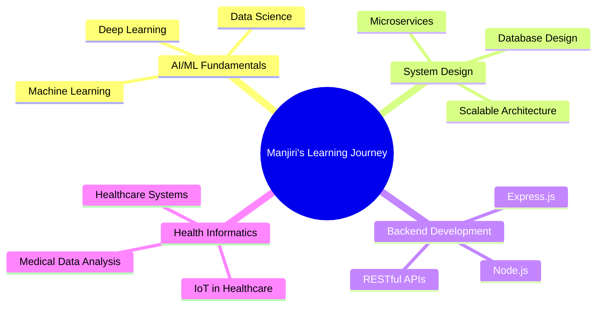

# Hi there! 👋 I'm **Manjiri Gawali**

---

---

## 🚀 **About Me**

🎓 **Student** | Pursuing **B.Tech in Computer Science Engineering (Health Informatics)** at **VIT Bhopal**  
📊 **Academic Excellence** | Current GPA: **8.64/10** | Graduating in **2027**  
💻 **Tech Enthusiast** | Passionate about **Full-Stack Development** and **Health Tech**  
🌱 **Currently Exploring** | **AI/ML fundamentals**, **System Design**, and **Backend Development**  
🧠 **Problem Solver** | Solved multiple **DSA problems** and contributed **500+ lines of code** during **GirlScript Summer of Code**  
🎨 **Fun Fact** | I balance coding with sports and creative design!  

 

---

## 🛠️ **Tech Stack & Tools**

### 💻 **Programming Languages**

### 🎨 **Frontend Development**

### 🔧 **Backend Development**

### 🛠️ **Tools & Technologies**

---

## 🏆 **Featured Projects**

| 🚀 **Project** | 📝 **Description** | 🛠️ **Tech Stack** | 🔗 **Links** |
|---|---|---|---|
| **Bank Account Management System** | A console-based banking system in C++ with OOP concepts, handling 1000+ transactions and persistent data storage | `C++` `OOP` `Data Structures` |  |
| **Remote Health Monitoring System** | A Flutter + Firebase + IoT system integrating ESP32 & biomedical sensors for real-time patient monitoring | `Flutter` `Firebase` `IoT` `ESP32` |  |
| **To-Do List Web App** | A responsive JavaScript app with task management, theme toggle, and smooth UI animations | `JavaScript` `HTML` `CSS` `Responsive Design` |   |

---

## 📊 **GitHub Statistics**

---

## 🏅 **Achievements & Contributions**

🌟 **GirlScript Summer of Code** - Contributed **500+ lines of code**  
🎯 **Problem Solving** - Solved multiple **Data Structures & Algorithms** problems  
📚 **Academic Excellence** - Maintaining **8.64/10 GPA** at VIT Bhopal  
🔬 **Health Tech Focus** - Specializing in **Health Informatics** applications  

---

## 🎯 **Current Focus**

---

## 📫 **Let's Connect!**

**I'm always excited to collaborate on innovative projects and discuss new opportunities!**

---

**Thanks for visiting my profile!**

